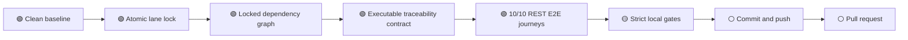

# A+ Quality Cockpit

Measured: 2026-07-17  
Branch: `chore/aplus-quality-20260717`

## Cockpit

| Gate | State | Exact evidence |
|---|---|---|
| Reproducible dependencies | green | `Cargo.lock` committed; all gates use `--locked` |
| Requirement traceability | green | 16/16 = 100.0% |
| Defined REST E2E journeys | green | 10/10 = 100.0% |
| Non-benchmark tests | green | 75/75 = 100.0% |
| Format / lint / docs | pending verification | strict commands in CI |
| Security policy | pending verification | `cargo audit --deny warnings` |
| Build / package smoke | pending verification | release build and `cargo package` |

No line-coverage percentage is claimed because a coverage instrument is not
locked in this repository. Test, E2E, and traceability counts are not substitutes
for line coverage.

## Progress bars

```text
Selection and lock       [##########] 100%
Traceability contract    [##########] 100%
Defined E2E journeys     [##########] 100%
Test pass rate           [##########] 100%
Strict local gates       [----------]   0% pending final verification
Publication              [----------]   0% gated on all local gates
```

## Colored DAG



## WBS

| ID | Work package | Exit criterion | State |
|---|---|---|---|
| 1.0 | Baseline | clean repository and bounded commands recorded | done |
| 2.0 | Reproducibility | committed lockfile; `--locked` gates | done |
| 3.0 | Traceability | exact matrix and executable >=85% contract | done |
| 4.0 | Verification | tests, fmt, clippy, docs, security, build, package | in progress |
| 5.0 | Delivery | commit, push, PR with evidence | gated |

## Release specification

The release scope is the currently exported item CRUD server, domain store,
GraphQL schema, and WebSocket adapter. Acceptance requires:

1. All 10 defined loopback REST journeys pass.
2. At least 85% of release requirements cite executable evidence.
3. All non-benchmark tests pass; Criterion benchmarks compile but do not run in
   the test gate.
4. Formatting, Clippy warnings, rustdoc warnings, RustSec advisories, release
   build, and package verification are strict failures.
5. The dependency graph is locked and no gate may rewrite it.

The future client API in `FUNCTIONAL_REQUIREMENTS.md` is backlog and is not
represented as shipped.

## ADR-005: Separate tests from Criterion execution

Status: accepted.

Decision: use `cargo test --lib --tests --locked` for the deterministic test
gate and `cargo bench --no-run --locked` to compile benchmark targets.

Rationale: `cargo test --all-targets` executes Criterion binaries because they
use `harness = false`. The measured baseline passed 72 tests, then exceeded the
300-second bound while executing benchmarks. Benchmarks are performance
experiments, not correctness tests.

Rejected: increasing the test timeout until benchmarks happen to finish. That
would keep a nondeterministic performance workload inside the correctness gate.

## Risk and control register

| Risk | Likelihood | Impact | Control | State |
|---|---|---|---|---|
| Dependency drift without a lockfile | high | high | commit `Cargo.lock`; require `--locked` | controlled |
| Matrix percentages become stale | medium | high | executable exact-denominator contract | controlled |
| Benchmarks make CI time out | high | medium | compile with `bench --no-run` | controlled |
| Tests use external services | low | high | REST E2E binds loopback port 0 only | controlled |
| Advisory database unavailable | medium | medium | local result plus mandatory CI gate | open until verified |
| Roadmap is mistaken for shipped API | medium | high | explicit release-scope boundary | controlled |
